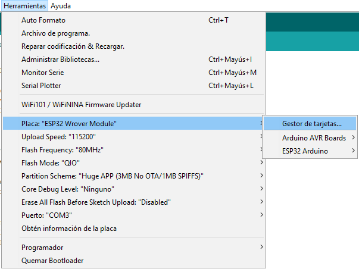
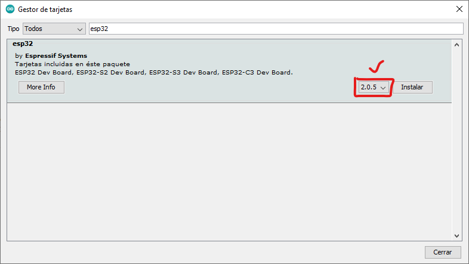
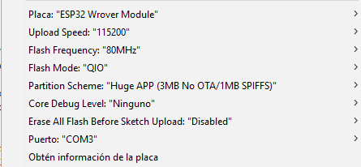
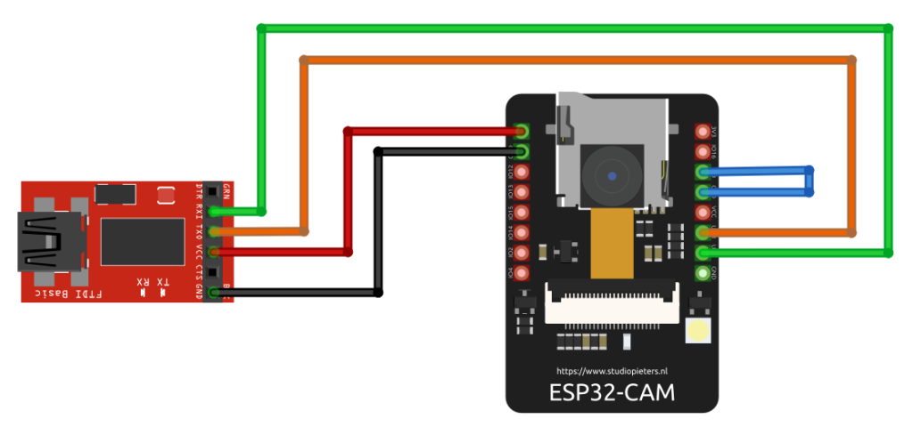

# Pasos

## **Instalar librerias necesarias para ESP32**

1. Colocar en preferencias en el gestor de URL el enlace para nuestra libreria
   > https://raw.githubusercontent.com/espressif/arduino-esp32/gh-pages/package_esp32_index.json
2. Ir al gestor de tarjetas para poder instalar la **_esp32_**
   <br>
   
   <br>
   Seleccionamos la version **_2.0.5_**
   

## **Configuracion para programar el modulo**

1. En arduino dirigirse a **_Herramientas_** y colocar la siguiente configuracion:  <br/>
   Si el puerto no se encuentra disponible, instalar el driver de la carpeta [Driver CP210x](./CP210x_Windows_Drivers/)
2. Para la conexion entre el modulo _ESP32_ y el _Adaptador FTDI_ utilizar el siguiente esquema:  <br>
   donde:
   | FTDI | ESP32 | ESP32 | CABLES |
   | :--: | :---------: | :---: | ------- |
   | VCC | 5v | | ROJO |
   | GND | GND | | NEGRO |
   | TX | GPIO3/U0RXD | | NARANJA |
   | RX | GPIO1/U0TXD | | VERDE |
   | | GPIO0 | GND | AZUL |

## Codigo

> Aruino [Cam stream](./color_tracker)

```c++
/*
Cambiar la red wifi para poder tener enlace al modulo,
es necesario una red wifi aunque no tenga conexion intenet,
pero permita el enlace entre el ESP32 y el computador
*/

const char* ssidRed = "tu_red"; /* Reemplaza tu SSID */
const char* passwordRed = "tu_contraseña"; /* Reemplaza tu Password */
```

> OpenCVjs [Detector de color](./WEBSITE/)

```javascript
/*
En base a la IP que nos de la consola del Arduino, podremos comunicarnos
a el, en el codigo de detection.js habra que cambiar nuestro host
*/

const host = "tu_IP";
```

Con las configuraciones realizadas, solamente basta con abrir nuestro [Sito de Deteccion](./WEBSITE/index.html) en el navegador para poder tener enlace de imagen

Al detectar el color rojo, el modulo activa el **_GPIO2_** y al detectar color azul, activa el **_GPIO14_**
